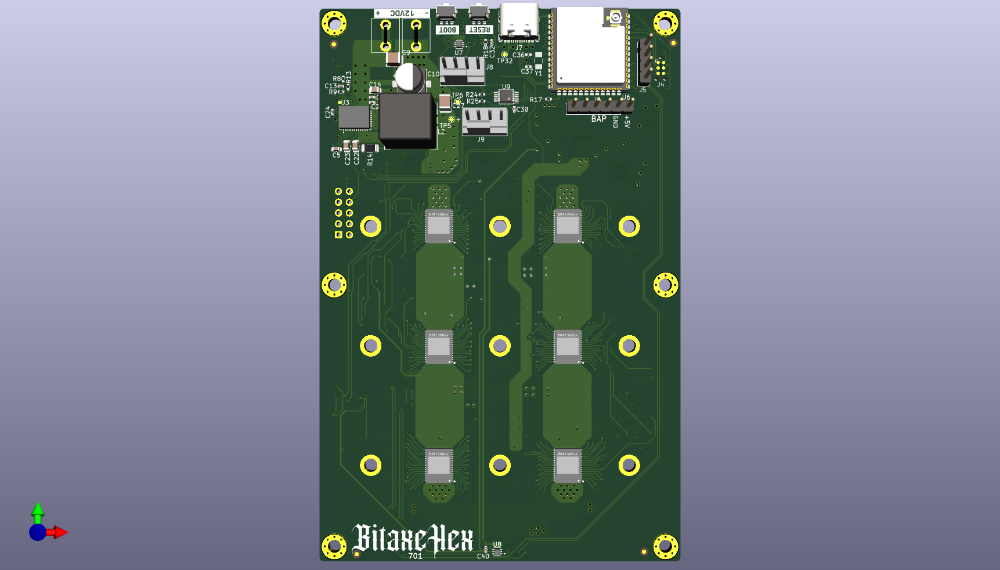

> Closed Source is Antithetical to Bitcoin

# Presenting: The supraHex
supraHex is a follow on to the [bitaxe](https://github.com/skot/bitaxe) that incorporates six BM1368 ASICs from the Antminer S21

## Goals
- **Standalone**: can mine directly to your pool over WiFi. No External computer needed.
- **Embedded**: low cost, low maintenance, high availability, high reliability, low power.
- **ASIC**: based on the very efficient BM1368 from Bitmain.
- **Versatile**: solo/pool mining, autotune power/heat/efficiency.
- **Open Source**: All design files are provided.

## Features
- **ESP32-S3-WROOM-1** wifi microcontroller on board
- **TI TPS546D24ARVFR** buck regulator steps down the 12V input to power the chain of BM1368
- **TMP1075** measures inlet and outlet PCB temperature.
- **Microchip EMC2302** Controls dual fans
- Header for optional status LCD
- BAP (Bitaxe Accesory Port)
- ASIC Chip temperature directly from the ASIC's

## BM1368
- The BM1368 is a undocumented SHA256 mining ASIC from Bitmain. It's mostly used in the Antminer S21
- Bitmain claims the BM1368 has 17.5 W/TH efficiency
- The BM1368 is available (new) for around $20~29 each.

## Current Status
- v701 hardware is working! Hash rate is fluctuating between 4 TH/s and 4.2 TH/s.
- Power draw is around 75W @12V.
- ESP32 miner firmware will configure the power supply to run at the proper voltage.
- This is an _advanced_ build! If you don't have experience building boards, you should probably go build a single ASIC bitaxe first to get the technique down.

## Revision List
- V701 is the current working version of this board.  If you want to build this, pull down this git tag.

## Hardware
- [BM1368 from NBTC](https://www.nbtcminer.com/shop/miner-parts/miner-chip/new-bm1368-bm1368pb-for-antminer-s21-t21-hdyro/). The `PB`Variant seems to work fine.
- [Heatsink](https://www.aliexpress.us/item/3256805608902122.html) 90mm long variant. This will need to have threaded M3 mounting holes added. See the KiCad board file for the pattern
- [Fans](https://www.amazon.com/Noctua-NF-A8-PWM-Premium-Quiet/dp/B00NEMG62M) At least one 80x80mm 12V 4-pin fan. Like the Noctua NF-A8 PWM. Possibly two.
- [Enclosure](https://www.aliexpress.us/item/3256806064761702.html) (several sellers) 130mm long variant. The supraHex needs to be run inside an enclosure to force air through the heatsink and effectively cool the BM1368s
- All of the parts on the board are listed in the KiCad BOM

## Software
- [ESP-Miner-Multichip](https://github.com/bitaxeorg/esp-miner-multichip) is still being updated to support multiple ASICs

## Power Supply Requirements
- supraHex takes 12V DC input via screw terminals. Power supply should be capable of 100W
  - This [120W Brick](https://www.amazon.com/gp/product/B07PWZQ33N) technically works, but gets a little warmer than it should. You'll need to change the end.
  - 12V 15A 110V AliExpress [Bare PSU](https://www.aliexpress.us/item/3256805439916551.html)

## Building
- Check out [building.md](building.md) for PCB ordering tips
- Check out [assembly.md](assembly.md) for assembly tips
